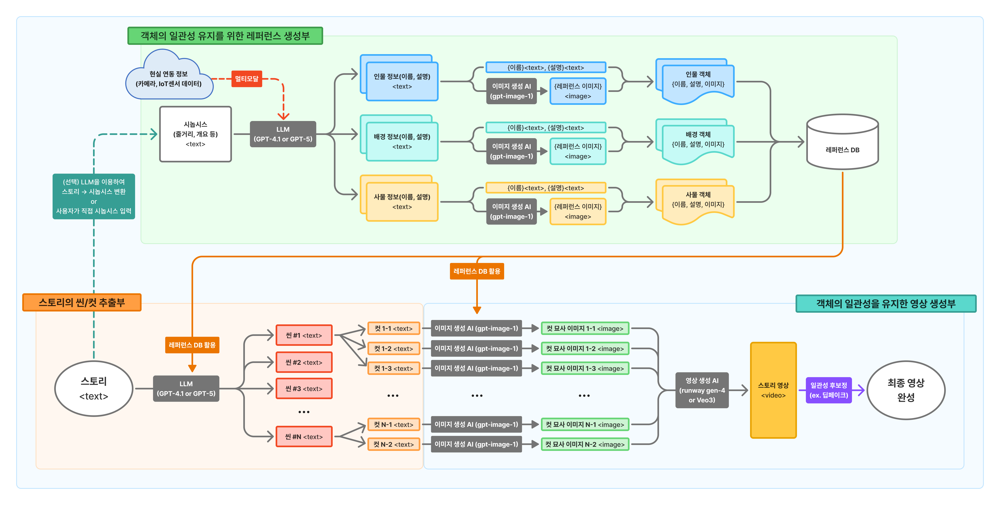

# 영상 구성 객체(인물·사물·배경)의 일관성을 유지한 AI 영상 자동 생성 기술 개발

> 과제명: AI기반 프롬프트 엔지니어링을 활용한 스토리 구조 영상 자동 생성 기술 개발
>
> consistent-ai-video-generator

2025학년도 동국대학교 컴퓨터공학전공 종합설계 백설기

## 🧑‍🤝‍🧑 팀 구성

| 학과      | 이름  | 역할                  |
|---------|-----|---------------------|
| 컴퓨터공학전공 | 김해환 | 프로젝트 총괄(팀장), 모듈 설계 및 통합, API서버 개발, UI/UX 개발  |
| 컴퓨터공학전공 | 노정우 | 객체의 일관성 유지를 위한 레퍼런스 생성부 개발    |
| 컴퓨터공학전공 | 라치현 | 객체의 일관성을 유지한 영상 생성부 개발    |
| 컴퓨터공학전공 | 안현우 | 스토리의 씬/컷 추출부 개발           |

> 지도교수: 컴퓨터·AI학부 김지희 교수
>
> 산업체 멘토: (주)스타일봇 허주일 이사

## ✏️ 프로젝트 개요

기존 영상 생성 AI 기술의 한계를 극복해 연속된 장면(씬)에서도 인물, 배경, 사물의 일관성을 유지하는 AI 영상 제작 시스템을 구현한다. 스토리의 객체(인물, 배경, 사물)를 분석하여 레퍼런스를 생성하고, 사용자가 입력한 스토리라인에 맞춰 레퍼런스와 프롬프트를 자동으로 구성하여, 장면 구성 객체의 일관성을 유지하는 AI 영상을 생성한다.
멀티모달 기능을 통해 현실의 객체를 영상에 반영하고, 실사·수채화·일러스트·동화 등 다양한 화풍으로 영상을 생성할 수 있다. 또한 최신 AI 모델을 쉽게 적용할 수 있도록 유연한 구조로 설계하여, 새로운 생성형 모델을 빠르게 적용할 수 있다.

## 💡 배경 및 필요성

- 기존 AI 영상 생성 모델은 단일 영상 생성에는 강점을 보이나, 스토리 구조를 갖춘 연속된 영상 생성에서는 객체(인물, 사물, 배경)의 일관성을 유지하기 어렵다는 한계가 있다.
- 스토리 구조 영상 생성 시 이전 영상의 속성을 유지하지 못하면 원하는 결과물을 도출하기 어렵다.
- 이러한 문제를 해결하기 위해 사용자의 입력에 따라 자동으로 객체를 구성하고 각 장면의 일관성을 보장할 수 있는 기술이 필요하다.

## 📝 프로젝트 구조

```
consistent-ai-video-generator/
├── consistentvideo/              # 핵심 라이브러리
│   ├── reference/                # 레퍼런스 생성 모듈
│   │   ├── synopsis_parser.py    # 스토리 파싱
│   │   ├── synopsis_analyzer.py  # 스토리 분석
│   │   └── entity_creator.py     # 객체 레퍼런스 생성
│   ├── story/                    # 씬/컷 추출 모듈
│   │   ├── scene_generator.py    # 씬 생성
│   │   ├── cut_generator.py      # 컷 생성
│   │   └── call_gpt.py          # GPT API 호출
│   ├── video/                    # 영상 생성 모듈
│   │   ├── cut_image_generator.py # 컷 이미지 생성
│   │   ├── video_generator.py    # 영상 생성
│   │   └── model_selector.py     # AI 모델 선택
│   ├── multimodal/               # 멀티모달 기능
│   │   └── entity_editor.py      # 객체 편집
│   └── aimodel/                  # AI 모델 (예비)
├── api-server/                   # FastAPI 백엔드 서버
│   ├── main.py                   # API 엔드포인트
│   └── requirements.txt          # Python 의존성
├── front-end/                    # Svelte 프론트엔드
│   ├── src/
│   │   ├── routes/              # 페이지 라우팅
│   │   │   ├── reference/       # 레퍼런스 관련 페이지
│   │   │   ├── story/           # 스토리 관련 페이지
│   │   │   └── video/           # 영상 관련 페이지
│   │   └── lib/
│   │       ├── components/      # UI 컴포넌트
│   │       ├── api.ts          # API 클라이언트
│   │       ├── stores.ts       # 상태 관리
│   │       └── types.ts        # TypeScript 타입
│   └── package.json
├── playground/                   # 개발 및 테스트용 스크립트
└── test/                        # 테스트 및 데모 파일 저장 폴더
```

## 🛠️ 시스템 설계



> ### 1. 객체의 일관성 유지를 위한 레퍼런스 생성부
>
> - 사용자가 입력한 스토리에서 인물, 배경, 사물 객체 추출 및 레퍼런스 생성
> - 멀티모달을 통해 현실의 객체를 반영한 레퍼런스를 생성
>
> ### 2. 스토리의 씬/컷 추출부
>
> - 사용자가 입력한 스토리에서 씬과 컷을 추출
>
> ### 3. 객체의 일관성을 유지한 영상 생성부
>
> - 레퍼런스를 이용하여 개별 컷으로부터 일관성이 유지된 AI 영상을 생성
> - 장면 간 객체의 일관성 유지
> - 다양한 화풍과 스타일 적용

위 세 가지 요소를 이용하여 사용자가 입력한 스토리를 바탕으로 장면 간인물, 배경 사물 객체 일관성을 유지하는 영상을 생성한다.

#### 모듈별 상세 설명

##### 1. Reference Module (레퍼런스 생성)

- **synopsis_parser.py**: 사용자 입력 스토리 파싱
- **synopsis_analyzer.py**: GPT API를 활용한 스토리 분석 및 객체 추출
- **entity_creator.py**: 추출된 객체로부터 레퍼런스 이미지 생성

##### 2. Story Module (씬/컷 생성)

- **scene_generator.py**: 스토리를 씬 단위로 분할
- **cut_generator.py**: 씬을 컷 단위로 세분화
- **call_gpt.py**: GPT API 호출 및 응답 처리

##### 3. Video Module (영상 생성)

- **cut_image_generator.py**: 컷별 이미지 생성
- **video_generator.py**: 이미지 시퀀스를 영상으로 합성
- **model_selector.py**: 사용 가능한 AI 모델 관리 및 선택

##### 4. Multimodal Module (멀티모달 처리)

- **entity_editor.py**: 사용자 업로드 이미지 처리 및 레퍼런스 통합

## 📚 기술 스택

#### Backend

[](https://skillicons.dev)

#### Frontend

[](https://skillicons.dev)

### API 서버 설계

#### 주요 엔드포인트

##### 스토리 관리

```
POST   /api/story/parse
  - 입력: { "story": "텍스트 스토리" }
  - 출력: { "entities": [...], "synopsis": {...} }

GET    /api/story/scenes
  - 출력: [ { "scene_id": 1, "description": "...", "cuts": [...] } ]

POST   /api/story/cuts
  - 입력: { "scene_id": 1, "cut_data": {...} }
  - 출력: { "cut_id": "...", "status": "created" }
```

##### 레퍼런스 관리

```
POST   /api/reference/generate
  - 입력: { "entity_id": "...", "description": "..." }
  - 출력: { "reference_image_url": "...", "status": "generated" }

POST   /api/reference/upload
  - 입력: FormData (image file)
  - 출력: { "reference_id": "...", "image_url": "..." }

PATCH  /api/reference/{id}
  - 입력: { "description": "...", "image_url": "..." }
  - 출력: { "updated": true }
```

##### 영상 생성

```
POST   /api/video/generate
  - 입력: { "style": "realistic", "cuts": [...] }
  - 출력: { "job_id": "...", "status": "processing" }

GET    /api/video/status/{job_id}
  - 출력: { "status": "completed", "progress": 100, "video_url": "..." }

GET    /api/video/download/{job_id}
  - 출력: Binary video file
```

## 💿 설치 및 실행 방법

### 사전 요구사항

- **Python 3.12 이상**
- **Node.js 18.x 이상**
- **FFmpeg 4.4 이상**
- **Git**

### 1. 프로젝트 클론

```bash
git clone https://github.com/CSID-DGU/2025-2-CECD2-1-whiteseolgi-08
cd 2025-2-CECD2-1-whiteseolgi-08
```

### 2. Backend 설정 및 실행

#### 2-1. Python 패키지 설치

프로젝트 루트에서 필요한 패키지를 설치:

```bash
pip install -r requirements.txt
```

#### 2-2. API 서버 패키지 설치

```bash
cd api-server
pip install -r requirements.txt
```

#### 2-3. 환경 변수 설정

루트 디렉토리에 `.env` 파일을 생성하고 필요한 API 키를 설정:

```bash
# .env 파일 예시
OPENAI_API_KEY="openai_api_key_here"
RUNWAY_API_KEY="runway_api_key_here"
GEMINI_API_KEY="gemini_api_key_here"
```

#### 2-4. API 서버 실행

```bash
# api-server 디렉토리에서 실행
uvicorn main:app --reload --port 8000 --host 0.0.0.0
```

- `--reload`: 코드 변경 시 자동 재시작 (개발 모드)
- `--port 8000`: 포트 8000에서 실행
- `--host 0.0.0.0`: 모든 네트워크 인터페이스에서 접근 허용

서버가 정상적으로 실행되면 다음 주소에서 API 문서를 확인할 수 있음:

- Swagger UI: <http://localhost:8000/docs>
- ReDoc: <http://localhost:8000/redoc>

### 3. Frontend 설정 및 실행

#### 3-1. npm 패키지 설치

새 터미널을 열고 프로젝트 루트에서:

```bash
cd front-end
npm i
```

#### 3-2. 개발 서버 실행

```bash
npm run dev -- --host
```

- `--host`: 네트워크의 다른 디바이스에서도 접근 가능하도록 설정

### 전체 시스템 실행 방법 정리

전체 시스템을 실행하려면 두 개의 터미널이 필요:

**터미널 1 - Backend:**

```bash
cd api-server
uvicorn main:app --reload --port 8000 --host 0.0.0.0
```

**터미널 2 - Frontend:**

```bash
cd front-end
npm run dev -- --host
```

#### FFmpeg 관련 오류

FFmpeg가 시스템 PATH에 있는지 확인:

```bash
ffmpeg -version
```

설치되어 있지 않다면:

- **Windows**: [FFmpeg 공식 사이트](https://ffmpeg.org/download.html)에서 다운로드
- **macOS**: `brew install ffmpeg`
- **Linux**: `sudo apt-get install ffmpeg` 또는 `sudo yum install ffmpeg`

## ✨ 기대효과

### 생성형 AI 영상 결과물의 일관성 유지

각 장면의 일관성을 유지하기 어려웠던 영상생성 AI의 한계를 극복하여, 객체의 일관성을 유지한 스토리 구조 영상을 생성

### 영상 제작 진입장벽 완화

1인 크리에이터와 같이 영상 제작을 위한 전문 기술을 갖추지 않더라도 **스토리 입력만으로 영상 생성**이 가능

### 미디어 믹스

좋은 작품(글)이 있지만 영상 등의 매체로 표현할 여력이 없는 작가들에게 자신의 작품을 손쉽게 다른 미디어로 표현할 수 있는 기회를 제공
